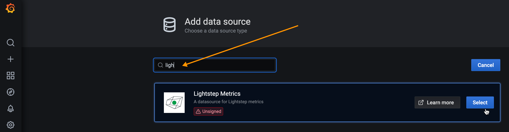
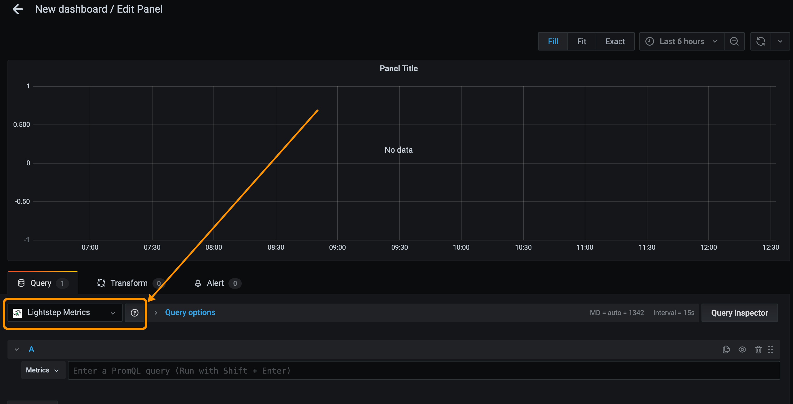
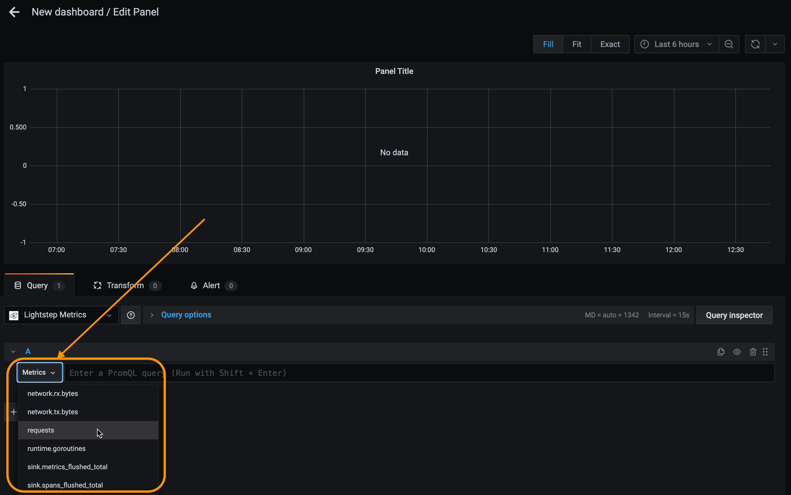
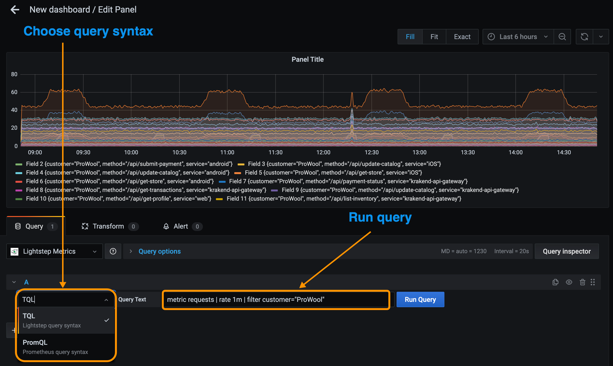
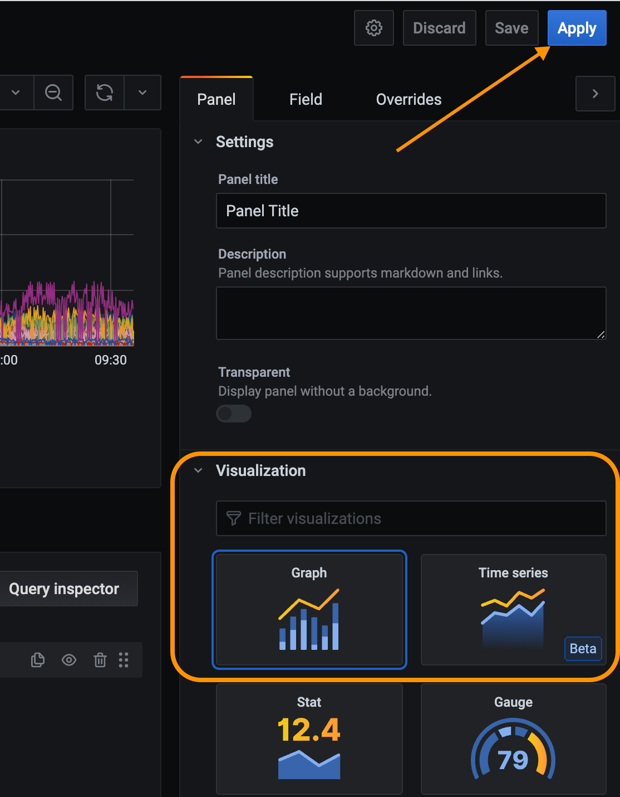

# Lightstep Observability Data Source

The Lightstep Observability Data Source allows you to view data from Lightstep directly in Grafana. You can use the plugin to visualize telemetry queries using Lightstep as the source of your telemetry data. And with Lightstep as your data source, you're able to directly drilldown into Lightstep Observability to root cause the issue of unexpected changes using advanced functionality like [Change Intelligence](https://docs.lightstep.com/docs/investigate-metric-deviation).

(🚧 UPDATE IMAGE)


**NOTE:** _The Lightstep Observability Data Source operates on a per-project basis. To enable the plugin for multiple Lightstep projects, follow these instructions for each project._

## Prerequisites

You'll need the following to enable and use the plugin:

- A Grafana account (version 7 and greater)

  **NOTE:** _The plugin only supports graph and time series charts._

- [Telemetry data](https://docs.lightstep.com/docs/send-metrics-to-lightstep) reporting to Lightstep. (🚧 UPDATE LINK)

- Your Lightstep "Organization" and "Project" name. Both can be found on on the [Project Settings page](https://docs.lightstep.com/docs/create-projects-for-your-environments) of Lightstep.

  

- A Lightstep [API key](https://docs.lightstep.com/docs/create-and-manage-api-keys) with Viewer permissions created just for Grafana.

  Paste the key someplace safe, as you will not be able to access it again from Lightstep.

## Installation

You can install the plugin using the Grafana CLI, or if your Grafana server doesn't have internet access, you can download and install it manually.

### Install from the CLI

Install the plugin from the Grafana CLI using [Grafana's plugin installation instructions](https://grafana.com/docs/grafana/latest/plugins/installation/).

```sh
grafana-cli plugins install lightstep-observability-datasource
```

### Install Manually

1. Download the zip file from GitHub releases page.

   ```sh
   https://github.com/lightstep/lightstep-observability-datasource/releases
   ```

### Developing and testing with Docker

The `Makefile` in this repository contains a `make dev` target that builds this plug-in and uses `docker-compose` to run a new instance of Grafana for development and testing.

When run the local development instance of Grafana should be available at [localhost:3000](http://localhost:3000/).

1. As with most Grafana Docker images, the default login/password is `admin`/`admin`.
2. Go to Settings > "Lightstep Provisioned Datasource" and set the Project Name, API host, and API key (based on your Lightstep account). "Save & test" the configuration.
3. Create a new Dashboard with a new Panel, select "Lightstep Provisioned Datasource" as the Data source and enter a query.

Note: the Makefile creates a local docker volume `grafana-data-lmd` to persist settings across launches so configuration is necessarily only on the first run.

## Enable the Lightstep Observability Data Source in Grafana

After you install the plugin, follow these steps. Steps may vary slightly depending on your version of Grafana.

1. Restart the Grafana server so it can discover the new plugin.
2. In the Navigation Bar, choose **Configuration**, select **Data Sources**, and click **Add data source**.

   

3. Start typing `Lightstep` in the search field to find the Lightstep Observability data source and click **Select**.

   

   (🚧 UPDATE IMAGE)<br/>
   (🚧 UPDATE THESE STEPS IF IT MUST BE INSTALLED FROM GITHUB?)

4. Enter your Lightstep organization and project name, paste in your Lightstep [API key](https://docs.lightstep.com/docs/create-and-manage-api-keys), and click **Save & Test**.

   Grafana confirms that it's connected to Lightstep.

   

You can now create dashboards and charts in Grafana using data provided by your Lightstep project.

## Create Grafana Charts from Lightstep Observability

With the Lightstep plugin installed, you can query your Lightstep data directly from Grafana.

1. In the Edit Panel view, make sure you've selected the Lightstep data source.

   
   (🚧 UPDATE IMAGE)<br/>

2. Use the **Metrics** dropdown to select the metric for your query.

   
   (🚧 UPDATE IMAGE)<br/>

3. Continue adding to your query in the **Metrics** field, using the [Lightstep's Unified Query Language (UQL)](). (🚧 UPDATE LINK)

   

   Click out of the field (or press `shift` + `Enter`) to run your query.

4. Choose the visualization for the chart (Lightstep supports either **Graph** or **Time Series**). Click **Apply** to create the graph.

   

## Investigate a Deviation from a Grafana Chart

Now that you have a chart in Grafana, when you notice a unexpected change in your data, you can investigate in Lightstep to rapidly find the root cause.

To investigate, click into the deviation and select **View what changed in Lightstep**.


You're taken into Change Intelligence in Lightstep, where you can [start your investigation](https://docs.lightstep.com/docs/investigate-metric-deviation).


View the query you made in Grafana by clicking the **View query** button.

 (🚧 UPDATE IMAGE)
